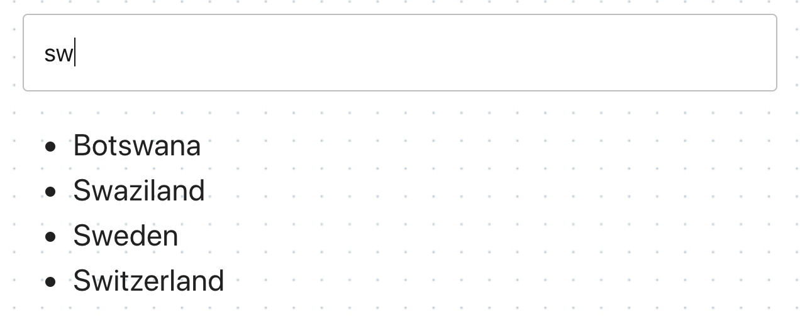
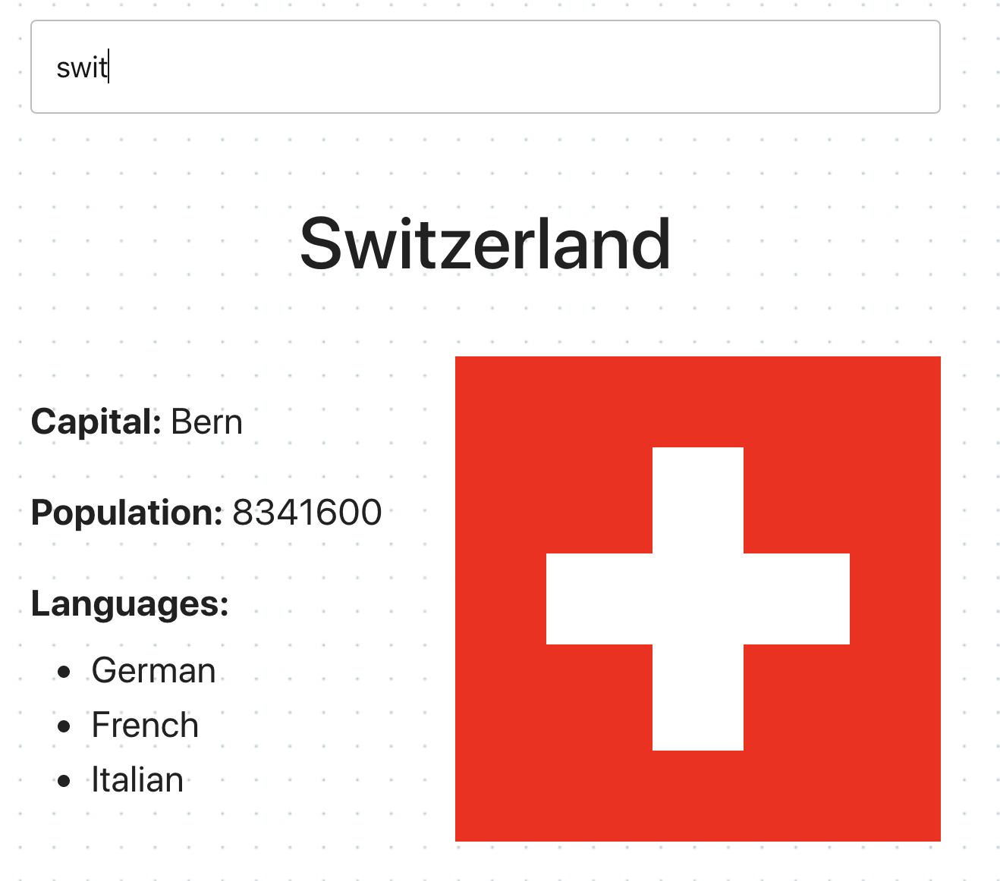

# Пошук країн

Створити невеликий додаток пошуку даних про країну по її частковому або повному
імені. Використовувати [Rest Countries API](https://restcountries.eu/), а саме
ендпоінт [/name](https://restcountries.eu/#api-endpoints-name), який повертає
масив об'єктів країн, що потрапили під критерій пошуку.

Досить, щоб додаток працював для більшості країн. Деякі країни, такі як:
`Sudan`, можуть створювати проблеми, оскільки назва країни є частиною назви
іншої країни, `South Sudan`. Не потрібно турбуватися про ці винятки.

Інтерфейс дуже простий. Назву країни для пошуку користувач вводить в текстове
поле.

⚠️ **УВАГА!** HTTP-запити на бекенд відбуваються не по сабміту форми, форми
немає, а при наборі імені країни в інпут, тобто за подією `input`. Але робити
HTTP-запит при кожному натисканні клавіші не можна, так як одночасно вийде
багато HTTP-запитів, які будуть виконуватися в непередбачуваному порядку (race
conditions). Тому на обробник події необхідно застосувати підхід `debounce` і
робити HTTP-запит через `500мс` після того, як користувач перестав вводити
текст. Слід використати npm-пакет
[lodash.debounce](https://www.npmjs.com/package/lodash.debounce).

Якщо бекенд повернув більше ніж 10 країн, які підійшли під критерій введений
користувачем, в інтерфейсі відображається нотифікація про те, що необхідно
зробити запит більш специфічним. Для сповіщень використовувати плагін
[pnotify](https://github.com/sciactive/pnotify).

Якщо бекенд повернув від 2-х до 10-ти країн, під інпутом відображається список
імен знайдених країн.

Якщо бекенд повернув масив з однією країною, в інтерфейсі рендерится розмітка з
даними про країну: назва, столиця, населення, мови і прапор.

